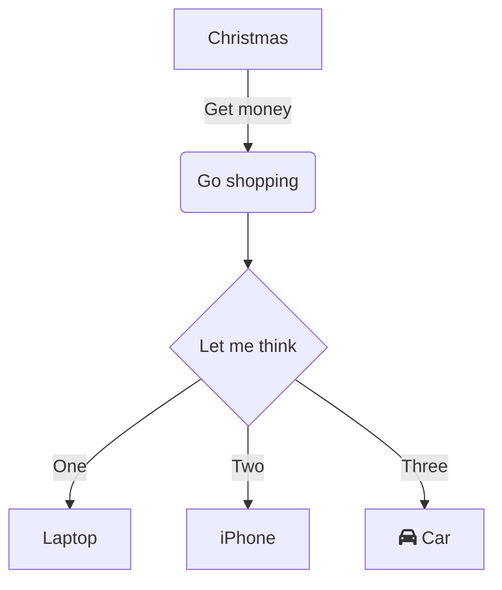

>date: WEEK 1 - Monday    - 18.07.2022   
>time: 

## Lecture Abstract
## R & D Project - Why it is an important paper?

- A core paper- a requirement for the BCIS qualification with a major. This paper is about applying knowledge to solve a client problem to their satisfaction.
- R & D project experience should help you get an IT role.
- By the end of the project you should have
  - industry/business experience and understanding 
  - the ability for continuous learning- self-learning and learning on the fly
  - new skills and knowledge: technical skills, frameworks, tools and technology, WBS [processes & practices], project management,  team work (task sharing), communication and interaction, negotiation skills.
  - agility/flexibility
  - emotional maturity and feel confident to apply for IT jobs
  - use the R & D experience (specific examples from above) to answer interview questions (have reality or facts)


---

## Cautions

**Paper leader:** Dr Ramesh Lal, ramesh.lal@aut.ac.nz , WZ1114, 6323. 
- Responsible for academic aspects of the paper. 

**Lecturers:** 
- Part 1 Workshops – Ramesh Lal
- Part 2 Workshops Associate Professor Jacqui Whalley, jwhalley@aut.ac.nz , WZ1118,5203 Workshops for both (part 1 and part 2) will focus on the assessments.\
  
**Industry advisor:** Karen Phipps, WT116, Karen.Phipps@aut.ac.nz

- Karen works with industry to source R & D projects. Karen helps us with  any issues related to the 
project clients.  She wants us to have a solid working relationship with the industry client and deliver what we agree to deliver.

**Project administrator**
- Marcella Nielsen. Marcella handles enrolments, withdrawals and attendance. You can contact her 
on cmsundergrad@aut.ac.nz or Marcella.Nielsen@aut.ac.nz


---

## Information and Contacts
**Canvas**
- All materials and notices for this paper will be on Canvas including for offshore R&D students: COMP703 2022_01 R & D Project. 
- Both Part 1 & Part 2 are offered through this single instance of the R & D paper
- Part 1 - COMP702 & COMP708 
- Part 2- COMP703 & COMP709 
- You should have access to canvas. If not  please email cmsundergrad@aut.ac.nz 

---

## Assessments OVerview
**COMP702 & COMP709 (Sem 1 of study) - Part 1:**

1. Project proposal (10%) - presentation in week 6
2. Mid-term review (10%)
   - Produce a status report provided to mentor and moderator in week 11
   - Make a presentation in week 12
   - At this point the markers will also ask to see your portfolio and its contents and your worklogs

**COMP703 & COMP709 (Sem 2 of study) - Part 2**

3. Client feedback (5%) due in week 12
4. Poster presentation (10%) held in week 13 or 14 (TBC)
5. Portfolio  (55%) due in week 14 (Monday), incuding
   - **Worklog book** (provides evidence that you, as an individual, have done a minimum of 300 hours in total and that these hours align with the work and artefacts produced)
6. Reflective report (10%) due in week 14 (Monday)
   


Lesson from ***[leacture pdf](https://canvas.aut.ac.nz/courses/11046/pages/week-1)***


>date: WEEK 1 - Tuesday   - 19.07.2022
>time:

## Note taking language & software learning

dfsgdsfgdsfg
dfg
dfg
dfg


---

**Reasons for choosing markdown**
After investigating the existing note taking software in the market I decided to use markdown as my main note taking software in the future. This is because markdown is more cost effective than other note taking languages. It takes less time to learn the code than more specialized languages, and more freedom than journaling tools that do not require programming. Not only that, it is a cross-platform universal language that works well on mac, windows, linux, and even mobile platforms. At the same time, markdown can be displayed on html browsers. On the other hand, the high level of market adoption has led to many and comprehensive tutorials, which will make my learning more efficient.


**markdown offical website:** [www.markdownguide.org](https://www.markdownguide.org/)

---

### Basic and Wxtended Syntax
| Element        | Markdown Syntax                                  |
| -------------- | ------------------------------------------------ |
| Header         | # H1 <br># H2<br> ### H3                         | 
| ParagraphBold  | Text	\*\*bold text**                             |
| Italic         | \*italicized text*                               |
| Blockquote	 | > blockquote                                     |
| Ordered List	 | 1. First item<br>2. Second item<br>3. Third item |
| Unordered List | - First item<br>- Second item<br>- Third item    |
| Code	         | \`code`                                          |
| Horizontal Rule| 	---                                             |
| Link	         | \[title](https://www.example.com)                |
| Image	         | \!\[alt text](image.jpg)                         |
| Table          | \| Syntax \| Description \|<br>\| ----------- \| ----------- \|<br>\| Header \| Title \|<br>\| Paragraph \| Text \|   |
|Fenced Code Block| \```<br>{<br>"firstName": "John",<br>"lastName": "Smith",<br>"age": 25<br>}<br>``` |
| Footnote       | Here's a sentence with a footnote. [^1] <br> [^1]: This is the footnote. |
| Heading ID     | \### My Great Heading {#custom-id}               |
| Definition List| term<br>: definition                             |
| Strikethrough  | 	~\~The world is flat.~~                         |
| Emoji          | That is so funny!        : joy:                  |
| Highlight      | I need to highlight these \==very important words==.|
| Subscript      | H\~2~O                                           |
| Superscript    | X\^2^                                            |

--- 

**Markdown supports** [KaTeX](https://katex.org/docs/api.html) **or** [MathJax](https://www.mathjax.org/) **to render mathematical expressions**

**code:**

\$\$
\begin{Bmatrix}
   a & b \\\\
   c & d
\end{Bmatrix}
\$\$
\$\$
\begin{CD}
   A @>a>> B \\\\
@VbVV @AAcA \\\\
   C @= D
\end{CD}
\$\$


**effect：**

$$
\begin{Bmatrix}
   a & b \\
   c & d
\end{Bmatrix}
$$
$$
\begin{CD}
   A @>a>> B \\
@VbVV @AAcA \\
   C @= D
\end{CD}
$$


**At the same time markdown also supports**  [mermaid](https://mermaid-js.github.io/mermaid/#/) **for rendering**
**code：**

\```mermaid
graph TD
    A[Christmas] -->|Get money| B(Go shopping)
    B --> C{Let me think}
    C -->|One| D[Laptop]
    C -->|Two| E[iPhone]
    C -->|Three| F[fa:fa-car Car]
\```


**effect：**



>date: WEEK 1 - Wednesday - 20.07.2022
>time:

team meeting

>date: WEEK 1 - Thursday  - 21.07.2022
>time:
## 顾客背景调查
WorkSafe New Zealand是新西兰主要工作场所的健康和安全监管机构。
前任机构是Ministry of Business, Innovation and Employment（MBIE）和department of labour


worksafe的工作原则：
#### 监管信心
- 开展监管活动，让人们相信新西兰的工作场所正在适当地管理健康和安全
- 使新西兰对 WorkSafe 作为主要的健康和安全监管机构充满信心
- 支持对健康和安全监管制度有效性的信心。

#### 伤害预防
使用智能针对所有级别（部门和系统范围）的关键风险
提供有针对性的干预措施以解决危害驱动因素（包括劳动力能力、员工敬业度和有效治理）
影响态度和行为以改善健康和安全风险管理。

####系统领导
领导、影响和利用健康和安全系统（包括其他监管机构）来改善健康和安全结果
促进和支持行业、组织和工人对健康和安全的领导
通过 WorkSafe 自身的良好实践以身作则。


worksafe机构高管：
[worksage Board Mumbers](https://www.worksafe.govt.nz/about-us/who-we-are/our-board/)


>date: WEEK 1 - Friday    - 22.07.2022
>time:
UML 
>date: WEEK 2 - Monday    - 23.07.2022
>time:
>date: WEEK 2 - Tuesday   - 24.07.2022
>time: 
>date: WEEK 2 - Wednesday - 
>time:
>date: WEEK 2 - Thursday  - 
>time: 
>date: WEEK 2 - Friday    - 
>time:

