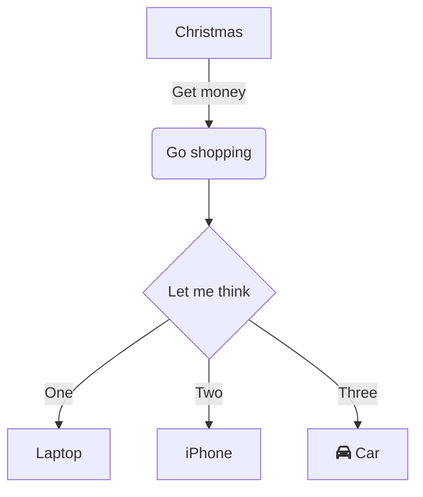

>date: WEEK 1 - Monday    - 18.07.2022<br>
>time: 
&nbsp;
>doing: lecture abstruct

## R & D Project - Why it is an important paper?**

- A core paper- a requirement for the BCIS qualification with a major. This paper is about applying knowledge to solve a client problem to their satisfaction.
- R & D project experience should help you get an IT role.
- By the end of the project you should have
  - industry/business experience and understanding 
  - the ability for continuous learning- self-learning and learning on the fly
  - new skills and knowledge: technical skills, frameworks, tools and technology, WBS [processes & practices], project management,  team work (task sharing), communication and interaction, negotiation skills.
  - agility/flexibility
  - emotional maturity and feel confident to apply for IT jobs
  - use the R & D experience (specific examples from above) to answer interview questions (have reality or facts)


## Cautions

**Paper leader:** Dr Ramesh Lal, ramesh.lal@aut.ac.nz , WZ1114, 6323. 
- Responsible for academic aspects of the paper. 

**Lecturers:** 
- Part 1 Workshops – Ramesh Lal
- Part 2 Workshops Associate Professor Jacqui Whalley, jwhalley@aut.ac.nz , WZ1118,5203 Workshops for both (part 1 and part 2) will focus on the assessments.\
  
**Industry advisor:** Karen Phipps, WT116, Karen.Phipps@aut.ac.nz

- Karen works with industry to source R & D projects. Karen helps us with  any issues related to the 
project clients.  She wants us to have a solid working relationship with the industry client and deliver what we agree to deliver.

**Project administrator**
- Marcella Nielsen. Marcella handles enrolments, withdrawals and attendance. You can contact her 
on cmsundergrad@aut.ac.nz or Marcella.Nielsen@aut.ac.nz


## Information and Contacts
**Canvas**
- All materials and notices for this paper will be on Canvas including for offshore R&D students: COMP703 2022_01 R & D Project. 
- Both Part 1 & Part 2 are offered through this single instance of the R & D paper
- Part 1 - COMP702 & COMP708 
- Part 2- COMP703 & COMP709 
- You should have access to canvas. If not  please email cmsundergrad@aut.ac.nz 


## Assessments Overview
**COMP702 & COMP709 (Sem 1 of study) - Part 1:**

1. Project proposal (10%) - presentation in week 6
2. Mid-term review (10%)
   - Produce a status report provided to mentor and moderator in week 11
   - Make a presentation in week 12
   - At this point the markers will also ask to see your portfolio and its contents and your worklogs

**COMP703 & COMP709 (Sem 2 of study) - Part 2**

3. Client feedback (5%) due in week 12
4. Poster presentation (10%) held in week 13 or 14 (TBC)
5. Portfolio  (55%) due in week 14 (Monday), incuding
   - **Worklog book** (provides evidence that you, as an individual, have done a minimum of 300 hours in total and that these hours align with the work and artefacts produced)
6. Reflective report (10%) due in week 14 (Monday)
   


Lesson from ***[leacture pdf](https://canvas.aut.ac.nz/courses/11046/pages/week-1)***


>date: WEEK 1 - Tuesday   - 19.07.2022
&nbsp;
>time:

## Note taking language & software learning

dfsgdsfgdsfg
dfg
dfg
dfg


---

**Reasons for choosing markdown**
After investigating the existing note taking software in the market I decided to use markdown as my main note taking software in the future. This is because markdown is more cost effective than other note taking languages. It takes less time to learn the code than more specialized languages, and more freedom than journaling tools that do not require programming. Not only that, it is a cross-platform universal language that works well on mac, windows, linux, and even mobile platforms. At the same time, markdown can be displayed on html browsers. On the other hand, the high level of market adoption has led to many and comprehensive tutorials, which will make my learning more efficient.


**markdown offical website:** [www.markdownguide.org](https://www.markdownguide.org/)

---

### Basic and Wxtended Syntax
| Element        | Markdown Syntax                                  |
| -------------- | ------------------------------------------------ |
| Header         | # H1 <br># H2<br> ### H3                         | 
| ParagraphBold  | Text	\*\*bold text**                             |
| Italic         | \*italicized text*                               |
| Blockquote	 | > blockquote                                     |
| Ordered List	 | 1. First item<br>2. Second item<br>3. Third item |
| Unordered List | - First item<br>- Second item<br>- Third item    |
| Code	         | \`code`                                          |
| Horizontal Rule| 	---                                             |
| Link	         | \[title](https://www.example.com)                |
| Image	         | \!\[alt text](image.jpg)                         |
| Table          | \| Syntax \| Description \|<br>\| ----------- \| ----------- \|<br>\| Header \| Title \|<br>\| Paragraph \| Text \|   |
|Fenced Code Block| \```<br>{<br>"firstName": "John",<br>"lastName": "Smith",<br>"age": 25<br>}<br>``` |
| Footnote       | Here's a sentence with a footnote. [^1] <br> [^1]: This is the footnote. |
| Heading ID     | \### My Great Heading {#custom-id}               |
| Definition List| term<br>: definition                             |
| Strikethrough  | 	~\~The world is flat.~~                         |
| Emoji          | That is so funny!        : joy:                  |
| Highlight      | I need to highlight these \==very important words==.|
| Subscript      | H\~2~O                                           |
| Superscript    | X\^2^                                            |

--- 

**Markdown supports** [KaTeX](https://katex.org/docs/api.html) **or** [MathJax](https://www.mathjax.org/) **to render mathematical expressions**

**code:**

\$\$
\begin{Bmatrix}
   a & b \\\\
   c & d
\end{Bmatrix}
\$\$
\$\$
\begin{CD}
   A @>a>> B \\\\
@VbVV @AAcA \\\\
   C @= D
\end{CD}
\$\$


**effect：**

$$
\begin{Bmatrix}
   a & b \\
   c & d
\end{Bmatrix}
$$
$$
\begin{CD}
   A @>a>> B \\
@VbVV @AAcA \\
   C @= D
\end{CD}
$$


**At the same time markdown also supports**  [mermaid](https://mermaid-js.github.io/mermaid/#/) **for rendering**
**code：**

\```mermaid
graph TD
    A[Christmas] -->|Get money| B(Go shopping)
    B --> C{Let me think}
    C -->|One| D[Laptop]
    C -->|Two| E[iPhone]
    C -->|Three| F[fa:fa-car Car]
\```


**effect：**



>date: WEEK 1 - Wednesday - 20.07.2022
&nbsp;
>time:

team meeting

>date: WEEK 1 - Thursday  - 21.07.2022
&nbsp;
>time:  2:00 pm to 3:30 pm - 1.5h

## Customer background checks
WorkSafe New Zealand is the primary workplace health and safety regulator in New Zealand.
The previous agencies were the Ministry of Business, Innovation and Employment (MBIE) and the Department of labour.


&nbsp;
## The Mission of WorkSafe
**Regulatory confidence**
- Regulatory activities to provide confidence that health and safety is being managed appropriately in New Zealand workplaces
- Gives New Zealand confidence in WorkSafe as the primary health and safety regulator
- Support confidence in the effectiveness of the health and safety regulatory system.hjk

&nbsp;
**Harm prevention**
- Targeting critical risks at all levels (sector and system-wide) using intelligence
- Delivering targeted interventions to address harm drivers (including workforce capability, worker engagement and effective governance)
- Influencing attitudes and behaviour to improve health and safety risk management.

&nbsp;
**System leadership**
- Leading, influencing and leveraging the health and safety system (including other regulators) to improve health and safety outcomes
- Promoting and supporting industry, organisation and worker leadership of health and safety
- Leading by example through WorkSafe's own good practices.

&nbsp;
**worksafe Agency executives** :[worksage Board Mumbers](https://www.worksafe.govt.nz/about-us/who-we-are/our-board/)<br>
**Minister responsible:** [Michael Wood](https://en.wikipedia.org/wiki/Michael_Wood_(New_Zealand_politician)), Minister for Workplace Relations and SafetyMinister for Workplace Relations and Safety 


>date: WEEK 1 - Friday    - 22.07.2022
&nbsp;
>time:
## UML Learning

https://www.youtube.com/watch?v=UI6lqHOVHic&t=1s
https://en.wikipedia.org/wiki/Unified_Modeling_Language

>date: WEEK 2 - Monday    - 23.07.2022
>time:

## TODO: lecture

>date: WEEK 2 - Tuesday   - 24.07.2022
>time: 

## Requirements analysis

- **Eliciting requirements:** <br>
   business process documentation, and stakeholder interviews. This is sometimes also called requirements gathering or requirements discovery.
- **Recording requirements:** <br>
  Requirements may be documented in various forms, usually including a summary list and may include natural-language documents, use cases, user stories, process specifications and a variety of models including data models.
- **Analyzing requirements:**<br>
   Determining whether the stated requirements are clear, complete, unduplicated, concise, valid, consistent and unambiguous, and resolving any apparent conflicts. Analyzing can also include sizing requirements.


https://en.wikipedia.org/wiki/Requirements_analysis


&nbsp;
## Requirements Analysis Process

1. **Eliciting requirements**<br>
    The process of gathering requirements by communicating with the customers is known as eliciting requirements.

2. **Analyzing requirements**<br>
   This step helps to determine the quality of the requirements. It involves identifying whether the requirements are unclear, incomplete, ambiguous, and contradictory. These issues resolved before moving to the next step.

3. **Requirements modeling**<br>
    In Requirements modeling, the requirements are usually documented in different formats such as use cases, user stories, natural-language documents, or process specification.

4. **Review and retrospective**<br>
   This step is conducted to reflect on the previous iterations of requirements gathering in a bid to make improvements in the process going forward.


&nbsp;
## Requirements Analysis Techniques

1.  **Business process modeling notation (BPMN)**<br>
   This technique is similar to creating process flowcharts, although BPMN has its own symbols and elements. Business process modeling and notation is used to create graphs for the business process. These graphs simplify understanding the business process. BPMN is widely popular as a process improvement methodology.
   

2. **UML (Unified Modeling Language)**<br>
   UML consists of an integrated set of diagrams that are created to specify, visualize, construct and document the artifacts of a software system. UML is a useful technique while creating object-oriented software and working with the software development process.  In UML, graphical notations are used to represent the design of a software project.  UML also help in validating the architectural design of the software.
   

3. **Flowchart technique**<br>
   A flowchart depicts the sequential flow and control logic of a set of activities that are related. Flowcharts are in different formats such as linear, cross-functional, and top-down.  The flowchart can represent system interactions, data flows, etc. Flow charts are easy to understand and can be used by both the technical and non-technical team members. Flowchart technique helps in showcasing the critical attributes of a process.
   

4. **Data flow diagram**<br>
   This technique is used to visually represent systems and processes that are complex and difficult to describe in text. Data flow diagrams represent the flow of information through a process or a system. It also includes the data inputs and outputs, data stores, and the various subprocess through which the data moves. DFD describes various entities and their relationships with the help of standardized notations and symbols.  By visualizing all the elements of the system it is easier to identify any shortcomings. These shortcomings are then eliminated in a bid to create a robust solution.
   [visual paradigm](https://www.visual-paradigm.com/guide/data-flow-diagram/what-is-data-flow-diagram/)
   

5. **Role Activity Diagrams (RAD)**<br>
   Role-activity diagram (RAD) is a role-oriented process model that represents role-activity diagrams. Role activity diagrams are a high-level view that captures the dynamics and role structure of an organization. Roles are used to grouping together activities into units of responsibilities. Activities are the basic parts of a role. An activity may be either carried out in isolation or it may require coordination with other activities within the role.
   

6. **Gantt Charts**<br>
   Gantt charts used in project planning as they provide a visual representation of tasks that are scheduled along with the timelines. The Gantt charts help to know what is scheduled to be completed by which date. The start and end dates of all the tasks in the project can be seen in a single view.

7. **IDEF (Integrated Definition for Function Modeling)**<br>
   Integrated definition for function modeling (IDEFM) technique represents the functions of a process and their relationships to child and parent systems with the help of a box. It provides a blueprint to gain an understanding of an organization’s system.

8. **Gap Analysis**<br>
   Gap analysis is a technique which helps to analyze the gaps in performance of a software application to determine whether the business requirements are met or not. It also involves the steps that are to be taken to ensure that all the business requirements are met successfully. Gap denotes the difference between the present state and the target state. Gap analysis is also known as need analysis, need assessment or need-gap analysis.


>date: WEEK 2 - Wednesday - 
>time:
>date: WEEK 2 - Thursday  - 
>time: 
>date: WEEK 2 - Friday    - 
>time:

